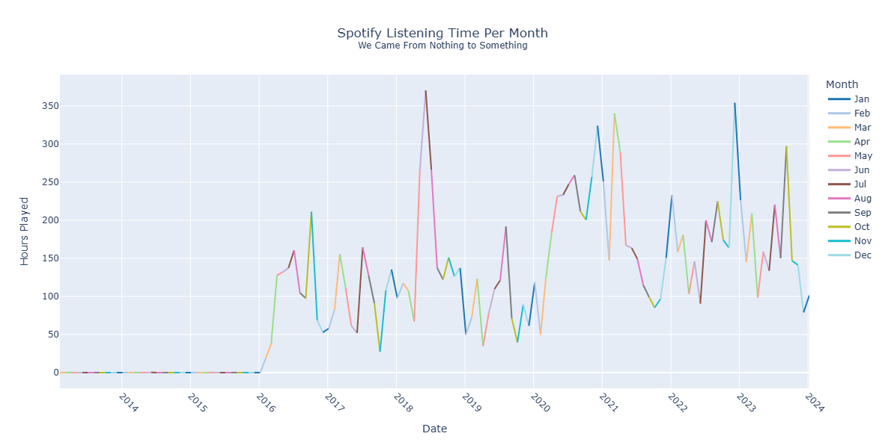
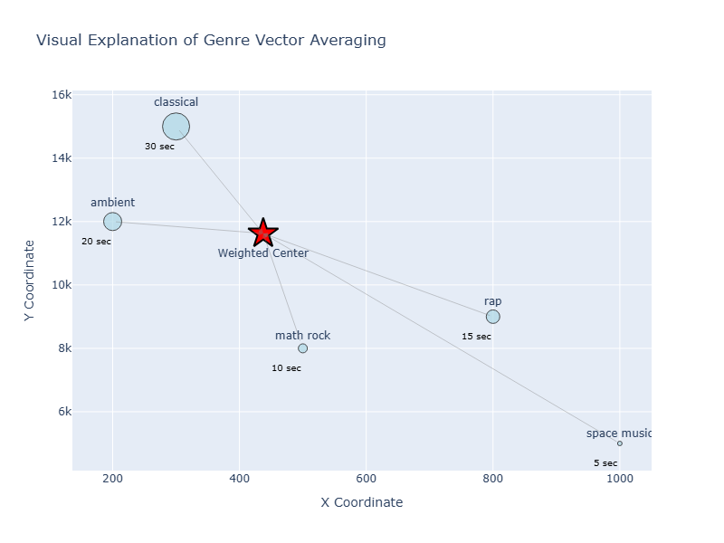

# Spotify Listening History Analysis

---

## 🗂️ Table of Contents

- [Overview](#-overview)
- [Analytical Questions](#-analytical-questions)
- [Executive Summary](#-executive-summary)
- [Tools](#-tools)
- [Project Setup](#-project-setup)
- [Repository Structure](#-repository-structure)


---

## Overview



This project explores Spotify listening history over a 10-year period to understand listening trends in streaming consumption, genre diversity, and format; emphasis was placed on answering the "Spotify Wrapped" questions across a wider time period. We also attempt to map the "musical centers of gravity" and locate new genres to recommend music for ourselves via plotting our streaming activity against [Every Noise at Once](https://everynoise.com) data within a 2D genre space.


---

## Analytical Questions

- When do I listen to the Spotify platform? Does that behavior change with seasons or the time of day?
- How have my listening behaviors and genre selections evolved over time? Do I have "core genres" or are my tastes more mercurial?
- What does the data reveal about my musical tastes, daily routines, and genre exploration over time?
- How can events in my personal and professional life impact listening behavior?
- Can we utilize external data sources to "profile" where our musical preferences are centered over time?

---

## Executive Summary

- **Ambient, drone, and minimalist genres** consistently and heavily dominate long-term listening. After 2021, lo-fi, vaporwave, and phonk gained larger amounts of hours played.
- **2020 was the most interesting year**: This year registered the lowest amount of hours played, simultaneously demonstrating the highest amount of genre diversity and podcast listening behavior.
- **Listening patterns are temporal in nature**: Peaks of streaming activity often occur in the Summer and Spring; peaks are also observed occur in the evening and morning times of day. This suggests streaming is tied to daily routines and that heightened streaming activity may coincide with holidays and vacation periods.
- **Podcast interest is negligible**, totaling to 21 hours of cumulative streaming activity over the multi-year listening history. 

---

## Tools

- **SQL**: PostgreSQL, SQLAlchemy, pgadmin4, psycopg2, joins, window functions, ranking
- **Python**: Pandas, numpy, datetime
- **Data Access and APIs**: requests, json, tqdm
- **Visualization**: Plotly, Seaborn, Matplotlib

---

## ⚙️ Project Setup

### 1. Clone This Repository
```
git clone https://github.com/terryjbates/Spotify-Listening-History-Analysis.git
cd Spotify-Listening-History-Analysis
```

### 2. Install Python Dependencies
We recommend using a Python [virtual environment](https://docs.python.org/3/library/venv.html), to more easily manage and control the sets of packages and dependencies for each project. Within that virtual environment, execute the following command within the virtual environment to install the same modules used in this analysis:
```
pip install -r requirements.txt
```
If you are using Anaconda, then you can replicate the virtual environment using this command:
```
conda env create -f environment.yml 
```


### 3. Obtain Spotify Data
This project analyzes an entire Spotify streaming history for an account and there is a bundled dataset within this repository. If you opt to run analysis against your personal Spotify listening history, please do the following:

1. Authenticate to your Spotify account. 
2. Go to your [Spotify account privacy settings](https://www.spotify.com/us/account/privacy/).
3. Deselect undesired options and tick the `Select Extended streaming history` box on the page.
4. Scroll to the bottom of the page and click `Request data`.
5. View the Spotify email confirming your history is ready to download and click the "Download" link.
6. Extract the `.json` files of the history download into of the `data/raw/` subdirectory of the local repository.

###  4. Setup a PostgreSQL Database
1. Download the [latest PostgreSQL version](https://www.postgresql.org/download/) for your OS environment.
2. Follow the installation instructions for your OS environment. This project utilized the [Windows OS](https://www.w3schools.com/postgresql/postgresql_install.php) version.
3. After PostgreSQL installation, we recommend installing [pgAdmin](https://www.w3schools.com/postgresql/postgresql_install.php) GUI program.
4. Start the PostgreSQL service if necessary.
5. Create a database to store the listening data. This project uses `spotify_streaming` as the database name.

### 5. Open Notebook

To view the notebook with the present analysis:
```
quarto render notebooks/spotify_analysis.qmd
```

Or open  `notebooks/spotify_analysis.ipynb` directly using [JupyterLab](https://jupyterlab.readthedocs.io/en/latest/).

---

## Repository Structure
```
Spotify-Listening-History-Analysis/
│
├── README.md
├── requirements.txt           # Packages to  recreate Python virtual environment
├── .env.example               # Storage of sensitive config and env vars (e.g., DB creds)
├── .gitignore                 # .gitignore configured with repo-specific settings
├── environment.yml            # Anaconda environment file
├── LICENSE                    # MIT License file 
|
├── data/
│   ├── raw/                            # Place Spotify JSON data files here
│   └── extract/
|       ├── podcast_categories.csv      # Manually curated podcast categories
|       └── spotify_data.csv            # Bundled Spotify dataset
|
├── exports/
│   ├── charts/                            
|   |   ├── genre_vector_sample.png           # Genre vector average sample image
|   |   └── listening_time_per_month.png      # Hours played per month plot
|   |
│   └── images/                            
|       └── ENAO_screenshot.png            # Screenshot of Every Noise at Once website genre space

|
├── notebooks/
│   └── spotify_analysis.ipynb    # Notebook with data analysis 
|
├── setup/
│   ├── postgres_setup.sql        # SQL commands to set up schema
│   └── schema_diagram.png        # ERD image 
│
├── sql/
    └── queries.sql               # Reusable SQL logic for augmentation and cleaning
```
---
